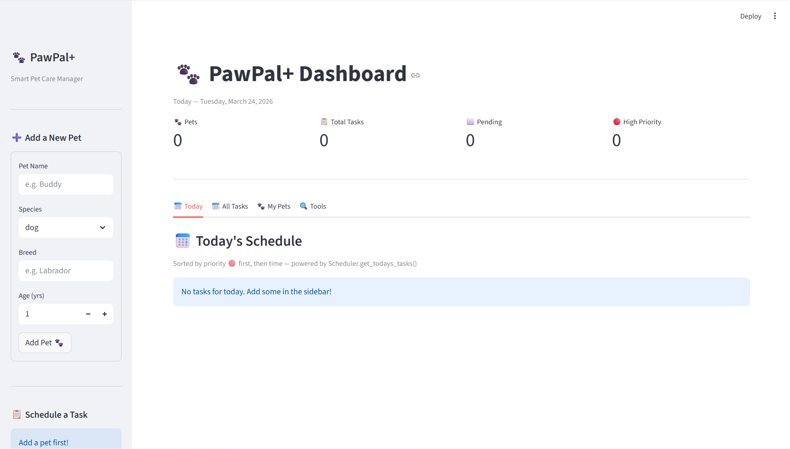

<!-- Created with Claude -->
# 🐾 PawPal+ — Smart Pet Care Management System

A pet care planning assistant that helps a busy owner stay on top of walks,
feedings, medications, and vet appointments — with smart algorithmic scheduling.

---
## 📸 Demo

**CLI demo** — run this to see all features working in the terminal:
```bash
python main.py
```

**Web app** — run this to open the interactive dashboard:
```bash
streamlit run app.py
```



---

## 🚀 Setup

```bash
# 1. Clone the repo and enter the folder
git clone https://github.com/dinakarbl00/ai110-module2show-pawpal-starter.git  # (or your fork URL)
cd ai110-module2show-pawpal-starter

# 2. Create and activate a virtual environment (recommended)
python -m venv .venv
source .venv/bin/activate        # Windows: .venv\Scripts\activate

# 3. Install dependencies
pip install -r requirements.txt

# 4. Run the CLI demo (verifies backend logic in the terminal)
python main.py

# 5. Run the web app
streamlit run app.py

# 6. Run the test suite
python -m pytest tests/ -v
```

---

## 🏗️ System Architecture

Four Python classes work together in `pawpal_system.py`:

**`Task`** — The smallest unit of work. Holds `description`, `due_time` (HH:MM),
`due_date` (YYYY-MM-DD), `frequency` (once / daily / weekly), `priority`
(low / medium / high), `completed`, `task_type`, and `task_id` (uuid).
Key methods: `mark_complete()` and `reschedule()` which returns a new Task
for the next occurrence of a recurring activity.

**`Pet`** — Stores a pet's identity (name, species, breed, age) and owns a list
of Task objects. Manages them via `add_task()`, `remove_task()`,
`remove_task_by_id()`, `get_pending_tasks()`, and `task_count()`.

**`Owner`** — Top-level data store. Holds pets and provides `get_all_tasks()`,
which flattens every pet's tasks into one list of `(pet_name, Task)` tuples.
This is the only way the Scheduler reads data, keeping the two classes
loosely coupled. Also handles JSON persistence via `save_to_json()` and
`load_from_json()`.

**`Scheduler`** — Pure algorithmic layer. Holds no data of its own — only
receives an Owner and operates on what `get_all_tasks()` returns. This
separation means the Scheduler can be tested in complete isolation.

---

## 📊 UML Class Diagram

See `uml_final.png` in the project root.

Key relationships:
- `Owner` **owns** (composition) zero or more `Pet` objects
- `Pet` **owns** (composition) zero or more `Task` objects
- `Scheduler` **depends on** one `Owner` via `get_all_tasks()`

---

## ✨ Features

### Core Features
- Add owners, pets, and tasks with full detail
- Task types with emojis: walk 🐾 · feeding 🍖 · medication 💊 · vet 🏥 · general 📋
- Priority levels with colour indicators: high 🔴 · medium 🟡 · low 🟢
- Mark tasks complete with a single click in the UI

### Smarter Scheduling

**Sorting — two strategies**
`sort_by_time()` orders tasks chronologically. Zero-padded HH:MM strings
sort correctly with plain string comparison — no datetime parsing needed.
`sort_by_priority_then_time()` uses a composite key `(-priority_rank, due_time)`
so high-urgency tasks surface first, with time as a tiebreaker within each tier.

**Filtering**
`filter_by_pet()`, `filter_by_status()`, `filter_by_date()`, and
`filter_by_priority()` all return `(pet_name, Task)` tuples so pet context
is never lost during filtering.

**Conflict Detection**
`detect_conflicts()` groups tasks into a dict keyed by `(date, time)`.
Any slot with two or more entries is a conflict. Returns human-readable
warning strings — never crashes the program.

**Recurring Tasks**
`mark_task_complete_and_reschedule()` marks a task done then calls
`task.reschedule()`. Daily tasks reappear `today + 1 day`; weekly tasks
`+ 7 days`. One-time tasks simply complete with no follow-up.

### Additional Features

**Next Available Slot**
`find_next_available_slot(date, start_time)` collects all booked times into
a hash set (O(1) lookup), then walks 30-minute increments until a free slot
is found. Suggested by Agent Mode — the hash-set approach was chosen over a
nested loop for being both faster and easier to read.

**Priority-Weighted Schedule**
`build_priority_schedule(date, max_tasks)` scores each pending task:
high = 30 pts, medium = 20 pts, low = 10 pts, +5 bonus for medication tasks.
Returns the top-ranked tasks, sub-sorted by time within each score band.

**Data Persistence**
`owner.save_to_json("data.json")` serialises the full owner → pets → tasks
tree. `Owner.load_from_json()` restores it. The Streamlit app loads saved
data automatically on every page refresh via `st.session_state`.

**Professional UI**
- Emoji indicators for task type and priority throughout
- `st.container(border=True)` cards for each task
- `st.table()` for the all-tasks view with sort and filter controls
- Summary metric cards (pets / total / pending / high-priority)
- Conflict warnings displayed via `st.warning()`
- 4 tabs: Today · All Tasks · My Pets · Tools

---

## 📁 File Structure

```
pawpal+/
├── pawpal_system.py     # Core logic — Task, Pet, Owner, Scheduler
├── main.py              # CLI demo — run this first to verify the backend
├── app.py               # Streamlit UI
├── data.json            # Auto-created on first save
├── uml_final.png        # UML class diagram
├── README.md
├── reflection.md
├── requirements.txt
└── tests/
    ├── __init__.py
    └── test_pawpal.py   # 29 tests across 9 behaviour groups
```

---

## 🧪 Testing PawPal+

```bash
python -m pytest tests/ -v
```

29 tests across 9 groups:

| Group | What it verifies |
|---|---|
| Task completion | `mark_complete()` flips the flag and returns a message |
| Adding tasks | `add_task()` increments count; pending/completed split is correct |
| Sorting | Chronological order; high priority first; time as tiebreaker |
| Rescheduling | Daily → tomorrow; weekly → next week; once → no new task |
| Conflicts | Same slot warns; different times don't; same time different date doesn't |
| Filtering | By pet name, status, and priority level |
| Edge cases | Empty pet/owner; slot finder; missing pet/task returns gracefully |
| Persistence | JSON round-trip; missing file returns None; completed flag preserved |
| Priority schedule | High ranked first; medication bonus; max_tasks cap respected |

**Confidence level: ⭐⭐⭐⭐⭐** — all 29 tests pass.

---

## 🤖 Agent Mode Note

The **Next Available Slot** algorithm was the primary place Agent Mode was
used. After describing the goal, the agent proposed two strategies:
a nested loop (O(n²)) and a hash-set approach (O(n)). The hash-set version
was accepted — it was both faster and clearer. The agent then scaffolded
`find_next_available_slot()` and the edge cases were verified manually
before committing.